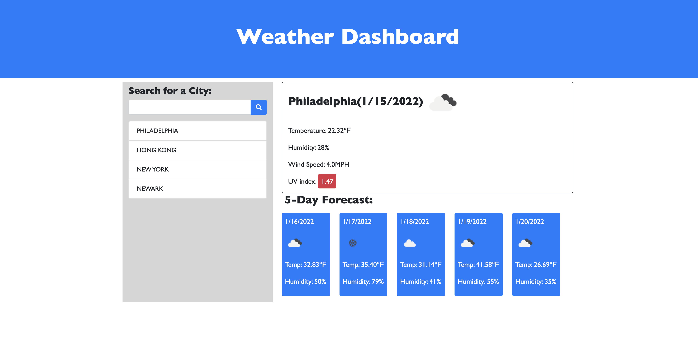
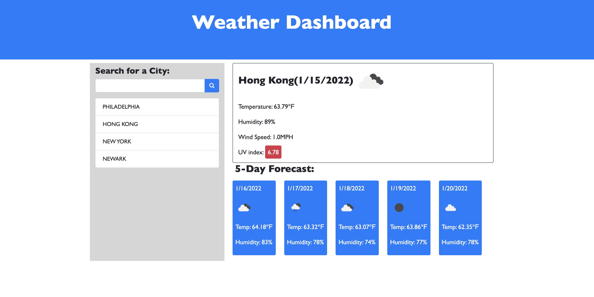

# Weather_Dashboard

## My Task

To build a weather dashboard with third-party APIs, [OpenWeather One Call API](https://openweathermap.org/api/one-call-api), that will run in the browser and feature dynamically updated HTML and CSS. And will use `localStorage` to store any persistent data.

## User Story

```
AS A traveler
I WANT to see the weather outlook for multiple cities
SO THAT I can plan a trip accordingly
```

## Mock-Up

The following image shows the web application's appearance and functionality:




### Deployment: https://bxz5089.github.io/Weather_Dashboard/
